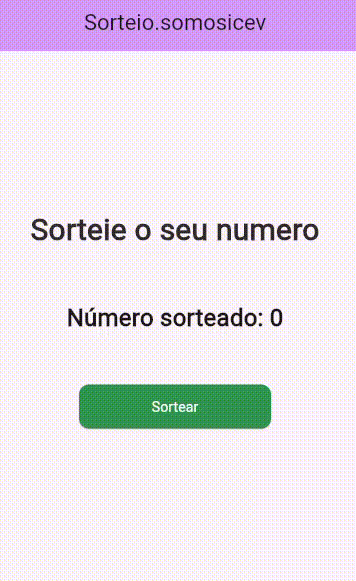

<h1 align="center"> SorteioApp </h1>

  

## Equipe

- and3510
- whosbea
- gustavodovale

## Objetivo

Criar um aplicativo simples de sorteio

## Resultados

<figure align="center">
  
   
  <figcaption>Gif do funcionamento</figcaption>
</figure>

